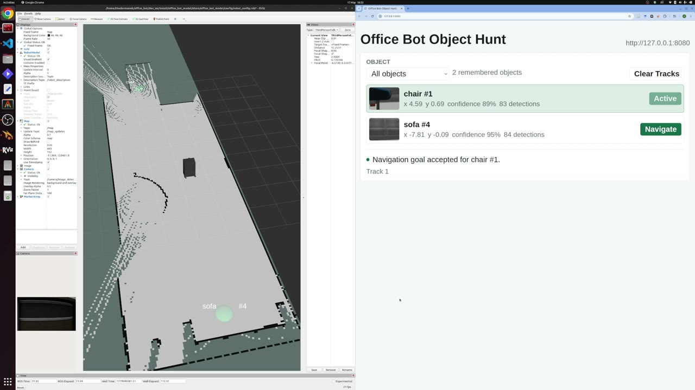
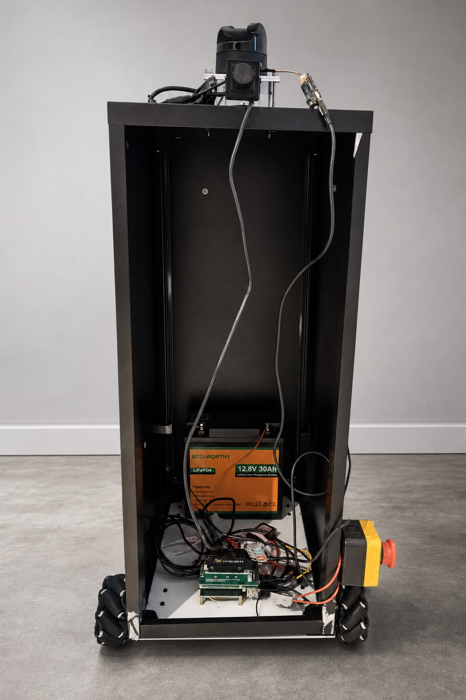

# OpenHRI

<p align="center">
  
</p>

`office_bot` is the reference office-robot project inside OpenHRI. OpenHRI is the umbrella for open, inspectable human-robot interaction workflows; this repository packages the `office_bot` simulation, object-search workflow, ROS packages, run recipes, and hardware bringup path.

The point is to avoid sealed robot demos that become hard to maintain when vendor support or setup notes disappear. Teams should be able to run the stack, inspect it, swap parts, change behavior, and understand what happened from logs and run outputs.

The current `office_bot` public release focuses on the simulation and repeatable run workflow. Raspberry Pi hardware bringup is tracked separately on the `hardware` branch.

## What Works

- Browser-accessible Gazebo/RViz desktop.
- ROS 2 Humble workspace with Nav2, SLAM, lidar, camera, and a reference mobile robot.
- YOLOX object detection with object localization, object memory, markers, and a web operator console.
- Repeatable object-search recipes under `recipes/trials/`.
- Run outputs under `runs/<trial-id>/`, including recipe copies, summaries, manifests, JSONL events, evaluator output, and reproducibility packages when a live run is completed.

## Demo Video

[](docs/assets/media/office-bot-object-hunt-demo.mp4)

The demo video shows the `office_bot` simulation, RViz view, object memory, and
object-navigation request flow.

## Early Hardware Prototype

<p align="center">
  
</p>

The early hardware prototype is assembled with onboard battery power, Raspberry
Pi 5 plus Axelera compute, motor control, lidar, camera, mecanum drive, and a
physical emergency stop on the left side of the robot.

Current hardware status:

- Onboard battery power works, with observed runtime of more than 10 hours.
- Mecanum wheels and motor controller are wired and can move under command.
- Low-speed motion has been tested through a raw motor-controller Python script.
- Lidar and camera are mounted and producing usable ROS data.
- Axelera acceleration hardware is installed and working.
- Object detection, SLAM, and navigation remain simulation-first while full
  robot-stack integration on the Raspberry Pi hardware is in progress.

## Quickstart

Prerequisites:

- Podman with Compose support.
- 8 GB or more free disk space.
- Enough memory for Gazebo, RViz, Nav2, and CPU PyTorch inference.

On macOS, start the Podman machine first:

```bash
podman machine start
```

Start the container:

```bash
make doctor
make start
```

Open the noVNC desktop:

```text
http://localhost:6080/vnc.html?autoconnect=1&resize=remote
```

Launch the simulation:

```bash
make sim
```

Start object detection in another terminal:

```bash
make detector
```

Open the object console:

```text
http://localhost:8080/
```

Detailed setup is in [docs/quickstart.md](docs/quickstart.md).

## Run Workflow

Run a planned recipe without starting the detector:

```bash
make trial-plan TRIAL=bottle-demo
```

Run a recipe after `make sim` is active:

```bash
make trial TRIAL=bottle-demo
```

`bottle-demo` records the declared target pose and setup notes, but it does not
spawn a bottle automatically. Confirm the target setup in
`recipes/trials/bottle-demo.yaml` before treating a run as complete.

Evaluate and package a completed run:

```bash
make trial-evaluate TRIAL=bottle-demo
make trial-pack TRIAL=bottle-demo
```

For a supervised session with simulation logs, detector logs, container logs, and run outputs in one tmux layout:

```bash
make workflow-session
```

Use [docs/workflow-guide.md](docs/workflow-guide.md) for the expected run loop and output package.

## Common Commands

```bash
make help        # Show available commands
make repo-check  # Check links, docs, recipes, and helper scripts without Podman
make doctor      # Check Podman, platform, ports, and disk space
make start       # Pull runtime, mount source, and bootstrap workspace
make sim         # Launch Gazebo, RViz, SLAM, Nav2, and the robot
make detector    # Start object detection and stream logs
make test        # Run ROS package tests inside the container
make shell       # Open a ROS-ready shell in the container
make down        # Stop and remove the container
```

Intel Linux and Intel Windows users can select the platform explicitly:

```bash
OPENHRI_PLATFORM=linux/amd64 make start
```

If ports are already in use:

```bash
OPENHRI_NOVNC_PORT=6081 OPENHRI_OBJECT_UI_PORT=8081 make start
```

## Project Layout

```text
dev_ws/
  src/
    office_bot_model/                 Robot model, office world, launch, Nav2, RViz
    office_bot_controller_handlers/   Controller helper nodes
    object_detector/                  Detection, localization, tracking, web UI
container/                           Runtime image scripts and desktop launchers
recipes/trials/                      Repeatable object-search recipes
scripts/                             Checks, trial runner, evaluator, packager, tmux session
docs/                                Operational docs
```

Common tuning files:

- `dev_ws/src/object_detector/config/object_detector.yaml`
- `dev_ws/src/object_detector/object_detector/localization.py`
- `dev_ws/src/object_detector/object_detector/tracking.py`
- `dev_ws/src/object_detector/object_detector/navigation.py`
- `dev_ws/src/object_detector/web/index.html`

## Docs

- [Quickstart](docs/quickstart.md)
- [Container quickstart](docs/container-quickstart.md)
- [Workflow guide](docs/workflow-guide.md)
- [Object Search and Approach](docs/object-search-and-approach.md)
- [Reproducibility](docs/reproducibility.md)
- [Logging spec](docs/logging-spec.md)
- [Asset attribution and license review](docs/asset-attribution.md)
- [Visual media guide](docs/visual-media-guide.md)
- [Preview release notes](docs/preview-release-notes.md)
- [Hardware BOM](docs/hardware-bom.md)
- [Hardware readiness checklist](docs/hardware-readiness-checklist.md)
- [Component swap guide](docs/component-swap-guide.md)
- [Runtime image release](docs/runtime-image-release.md)
- [Troubleshooting](docs/troubleshooting.md)
- [Security policy](SECURITY.md)

## Native ROS 2 Workflow

The container path is the recommended workflow. For native Ubuntu 22.04 / ROS 2 Humble development:

```bash
cd dev_ws
source /opt/ros/humble/setup.bash
colcon build --symlink-install
source install/local_setup.bash
./launch_sim.sh
```

## Project Status

The current public release covers the simulation and recipe-backed workflow.
Physical robot deployment is outside the scope of this branch until the hardware
readiness documentation records completed subsystem evidence. Bundled
Gazebo/Ignition world assets have separate attribution and redistribution
limits described in [docs/asset-attribution.md](docs/asset-attribution.md).

## License

OpenHRI `office_bot` source code is licensed under the Apache License 2.0. See [LICENSE](LICENSE). The root [NOTICE](NOTICE) records the license boundary for bundled Gazebo/Ignition world assets, which include third-party model metadata and require the separate review described in [docs/asset-attribution.md](docs/asset-attribution.md).
